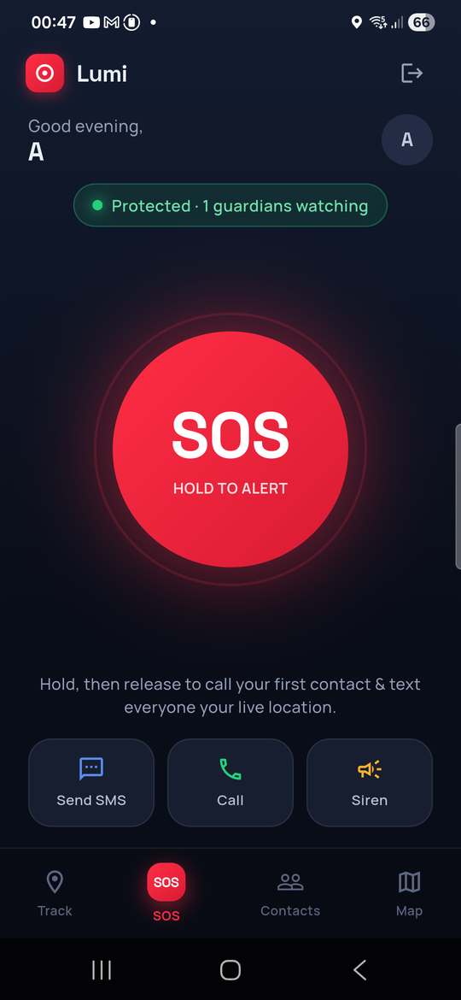
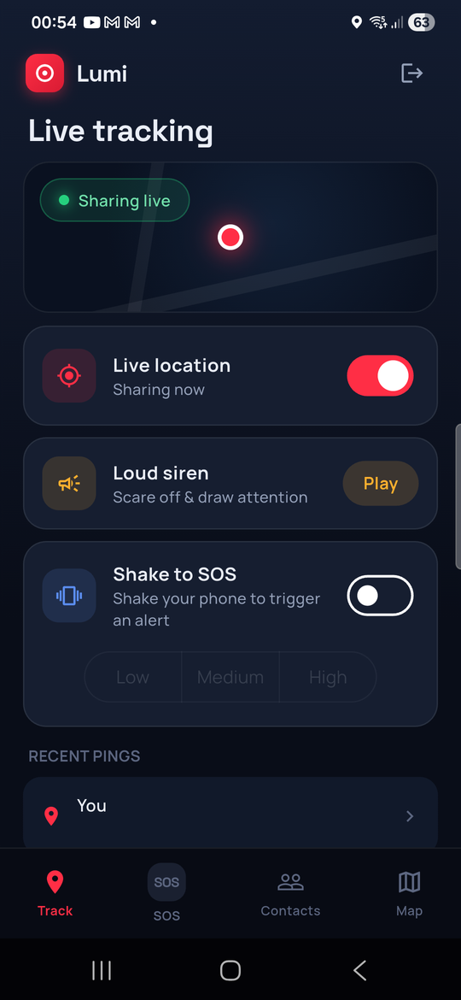
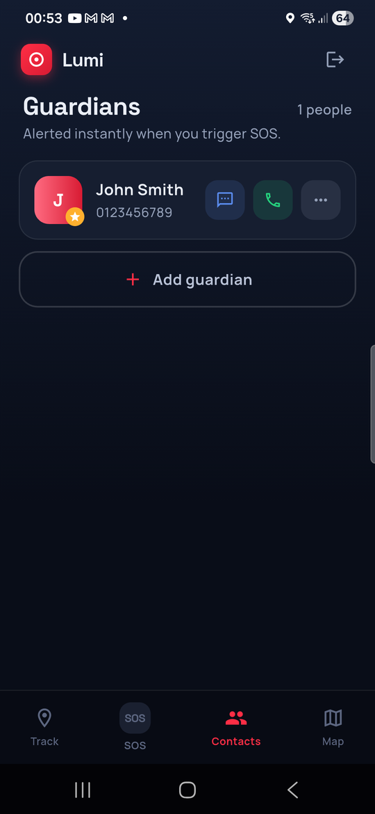

# Lumi — Personal Safety App

A Flutter personal-safety application that lets someone in an emergency reach
their designated contacts fast: a hold-to-alert SOS button, shake-to-SOS that
works even with the app in your pocket, live location sharing, and a
guardian-facing live map that works in any browser with no account or app
install.

Built as a graduation project after a background study of ~200 existing
safety apps, most of which proved costly, feature-limited, or hard to use
under pressure. When someone is in danger they can't process complex UI —
every flow here is designed to work with one hand, one gesture, and no
reading.

| SOS | Live tracking | Guardians |
|:---:|:---:|:---:|
|  |  |  |

## Features

### Alerting
- **SOS hold button** — press and hold the big red button; a ring fills and
  releasing sends the alert (SMS with your location to every guardian + a
  phone call to your primary contact). Sliding off cancels — no accidental
  sends.
- **Shake to SOS** — shake the phone twice to trigger a cancellable
  countdown, with adjustable sensitivity (Low / Medium / High). On Android
  this runs in a **foreground service**, so it keeps working with the app
  backgrounded, the screen off, or the phone in Doze — a persistent
  notification carries the countdown and an "I'm safe — cancel" action.
- **Quick actions** — one-tap Send SMS / Call / Siren from the SOS screen.
- **Loud siren** — deliberately has no stop button: once triggered it plays
  to completion, so an attacker taking the phone can't silence it.

### Guardians
- Local, private contact book (SQLite) — guardians get alerts by SMS/call,
  no account or app needed on their side.
- **Primary contact** — star any guardian from their "⋯" menu; they become
  the one who receives the emergency phone call. Falls back automatically
  if unset or if the primary is deleted.

### Location
- **Live tracking** — opt-in continuous location sharing to Firestore, with
  per-user privacy (each user can only ever read/write their own location
  document, enforced by security rules).
- **Guardian live-view link** — every alert SMS includes two links: an
  instant static Google Maps pin, and a **live web page**
  (`share.html?id=…`) where the guardian watches the marker move in real
  time. Links are unguessable random tokens and expire after 2 hours,
  enforced by Firestore security rules — no server-side jobs, no guardian
  login. Firing an alert auto-enables live sharing so the map actually
  moves.
- **Route planning map** — Google Maps with start/destination routing.

## Tech stack

| Layer | Technology |
|---|---|
| App | Flutter / Dart, Material 3 |
| Auth & data | Firebase Auth, Cloud Firestore |
| Local storage | SQLite (`sqflite`) for contacts, `shared_preferences` for settings |
| Maps | Google Maps (Flutter plugin + JavaScript API on the web page) |
| Background work | `flutter_foreground_task` (Android foreground service) |
| SMS / calls | `telephony` (silent background SMS), `flutter_phone_direct_caller` |
| Guardian web page | Hand-written static HTML/JS on Firebase Hosting (loads instantly — no framework bundle) |

## Architecture notes

- **One alert pipeline.** The SOS button, shake-to-SOS (foreground and
  background), and any future trigger all funnel through a single
  `EmergencyAlert` service, so alert behavior can never drift between
  triggers. A hard invariant, regression-tested: nothing added to an alert
  path may throw past it — a failing bonus feature (share link, live
  location) degrades silently rather than blocking the SMS/call.
- **Pure-Dart state machines.** The countdown/cancel/dispatch logic for
  background shake handling lives in plugin-free classes with `fake_async`
  unit tests; the service layer only maps callbacks to notifications.
- **Security rules as the backend.** Share-link expiry and per-user location
  privacy are enforced in `firestore.rules` (covered by emulator-based rules
  tests in `firestore-tests/`), not by trusted client code or Cloud
  Functions.

## Getting started

```bash
flutter pub get
flutter run
```

Firebase configuration (`lib/firebase_options.dart`, `google-services.json`)
is generated via `flutterfire configure` and already committed for this
project. Google Maps requires the API key present in
`android/app/src/main/AndroidManifest.xml`.

Deploying the guardian web page and Firestore rules:

```bash
firebase deploy --only firestore:rules,hosting
```

## Testing

```bash
flutter test          # Dart/Flutter suite (services, widgets, state machines)
cd firestore-tests && npm install && npm test   # security-rules tests (Firestore emulator)
```

Physical-device behaviors (background shake detection through Doze, SMS
delivery, the live guardian map) are verified on a real Samsung device —
emulators can't exercise real sensors, telephony, or OEM power management.

## Project documentation

Design specs and implementation plans for each feature live in
[`docs/superpowers/specs/`](docs/superpowers/specs) and
[`docs/superpowers/plans/`](docs/superpowers/plans) — including
shake-to-SOS (foreground and background), shake sensitivity, the primary
guardian contact, and the guardian live-view share link.
