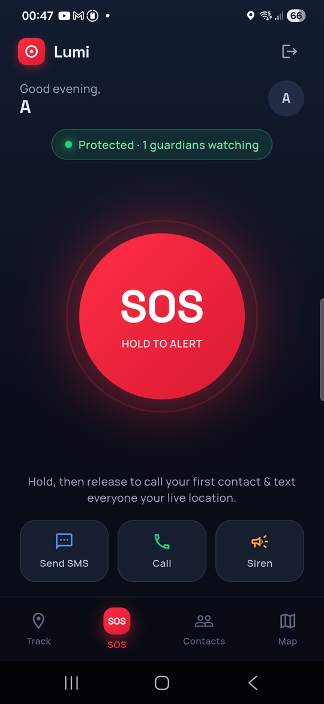
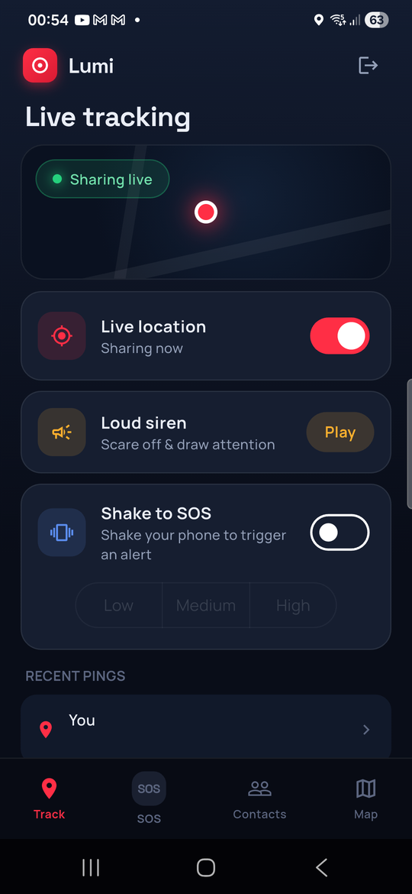
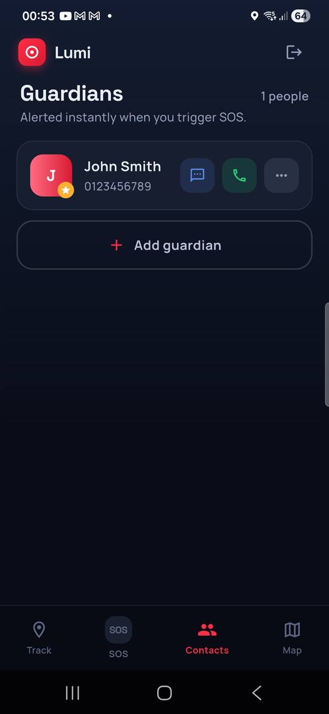

# Lumi — Personal Safety App

A Flutter personal-safety application that lets someone in an emergency reach
their designated contacts fast. Four ways to raise an alert — hold the SOS
button, shake the phone, press volume-down three times silently, or let a
check-in timer expire — two of which keep working with the app closed and
the phone in your pocket. All four funnel through one pipeline, alongside
live location sharing and a guardian-facing live map that works in any
browser with no account or app install. For situations that need an exit
rather than an alarm, it can also stage a fake incoming call.

Built as a graduation project after a background study of ~200 existing
safety apps, most of which proved costly, feature-limited, or hard to use
under pressure. When someone is in danger they can't process complex UI —
every flow here is designed to work with one hand, one gesture, and no
reading.

| SOS | Live tracking | Guardians |
|:---:|:---:|:---:|
|  |  |  |

## Features

### Alerting
- **SOS hold button** — press and hold the big red button; a ring fills and
  releasing sends the alert (SMS with your location to every guardian + a
  phone call to your primary contact). Sliding off cancels — no accidental
  sends.
- **Shake to SOS** — shake the phone twice to trigger a cancellable
  countdown, with adjustable sensitivity (Low / Medium / High). On Android
  this runs in a **foreground service**, so it keeps working with the app
  backgrounded, the screen off, or the phone in Doze — a persistent
  notification carries the countdown and an "I'm safe — cancel" action.
- **Silent SOS trigger** — press volume-down three times quickly (Android,
  opt-in from the Track page) to arm a fully silent alert: no on-screen UI
  at any point, only haptic pulses confirm each step. An 8-second grace
  period follows arming; the same 3× pattern during that window cancels.
  Suppresses the system volume popup while enabled so the whole gesture
  stays invisible on screen — for when being *seen* reaching for a safety
  app is itself the risk.
- **Check-in timer ("walk me home")** — from the Track page, set a timer
  before a risky trip (10/20/30/60 min presets or a custom duration, plus an
  optional note like "walking through the park"). If you don't check in
  before it expires, a 60-second grace notification offers "I'm safe —
  cancel"; if that passes too, guardians automatically get the full alert —
  including your note — even with the app backgrounded, via the same
  foreground service as shake-to-SOS.
- **Quick actions** — one-tap Send SMS / Call / Siren from the SOS screen.
- **Loud siren** — deliberately has no stop button: once triggered it plays
  to completion, so an attacker taking the phone can't silence it.

### Getting out of a situation
- **Fake incoming call** — stage a realistic call (configurable caller name
  and number, Now/10s/30s/1 min delay) from the SOS screen to excuse
  yourself from an uncomfortable situation. Rings with the device's own
  system ringtone and vibrates; answering opens a real-looking in-call
  screen with a running timer. Purely cosmetic — completely separate from
  the alert pipeline, so it can never fire a real alert.

### After the fact
- **Alert history** — every real alert dispatch (SOS button, shake, check-in
  timer, silent trigger) is logged locally with its trigger, timestamp and
  outcome, viewable on the History tab. Attempts that reached nobody are
  logged too, as `Failed — Add emergency contacts first.`, so a silent
  trigger that quietly did nothing still leaves a trace. Local-only (never
  synced), capped at the 50 most recent entries, with a confirm-then-wipe
  Clear action.

### Guardians
- Local, private contact book (SQLite) — guardians get alerts by SMS/call,
  no account or app needed on their side.
- **Primary contact** — star any guardian from their "⋯" menu; they become
  the one who receives the emergency phone call. Falls back automatically
  if unset or if the primary is deleted.

### Location
- **Live tracking** — opt-in continuous location sharing to Firestore, with
  per-user privacy (each user can only ever read/write their own location
  document, enforced by security rules).
- **Guardian live-view link** — every alert SMS includes two links: an
  instant static Google Maps pin, and a **live web page**
  (`share.html?id=…`) where the guardian watches the marker move in real
  time. Links are unguessable random tokens and expire after 2 hours,
  enforced by Firestore security rules — no server-side jobs, no guardian
  login. Firing an alert auto-enables live sharing so the map actually
  moves.
- **Route planning map** — Google Maps with start/destination routing.

## Tech stack

| Layer | Technology |
|---|---|
| App | Flutter / Dart, Material 3 |
| Auth & data | Firebase Auth, Cloud Firestore |
| Local storage | SQLite (`sqflite`) for guardians and alert history, `shared_preferences` for settings |
| Maps | Google Maps (Flutter plugin + JavaScript API on the web page) |
| Background work | `flutter_foreground_task` (Android foreground service) |
| SMS / calls | `telephony` (silent background SMS), `flutter_phone_direct_caller` |
| Sensors / hardware | `shake` (accelerometer), `flutter_ringtone_player` (fake call), a Kotlin `dispatchKeyEvent` override for volume-key capture |
| Guardian web page | Hand-written static HTML/JS on Firebase Hosting (loads instantly — no framework bundle) |
| Testing | `fake_async` + `clock` for time-dependent state machines, `sqflite_common_ffi` for real DB tests, `fake_cloud_firestore` / `firebase_auth_mocks` |

## Architecture notes

- **One alert pipeline.** All five triggers — SOS button, shake (foreground
  and background), silent volume pattern, and the check-in timer — funnel
  through a single `EmergencyAlert` service, so alert behavior can never
  drift between them. Adding the history log meant instrumenting exactly two
  methods rather than five call sites, and any future trigger is covered for
  free.
- **Nothing may throw past an alert.** A hard invariant: a failing bonus
  step (share link, live location, history logging) degrades silently rather
  than blocking the SMS/call. It's enforced by tests, not inspection —
  `EmergencyAlert.historyDbFactory` is a `@visibleForTesting` seam so a
  throwing *and* a hanging store can both be injected. The timeout matters
  as much as the `try/catch`: a `try/catch` guards a throw, not a hang. Both
  guards are mutation-checked (delete the timeout and the hang test fails;
  delete the catch and the throw test fails), because a passing test that
  wouldn't catch the regression is worse than no test.
- **Pure-Dart state machines.** Every countdown/cancel/dispatch rule —
  background shake, check-in timer, the silent trigger's press-window
  matcher, the fake call's phase machine — lives in plugin-free classes
  driven by `clock`, unit-tested with `fake_async`. The service and widget
  layers only map callbacks to notifications and pixels.
- **SQLite where Firestore can't reach.** The alert history is SQLite, not
  Firestore, because it's written from the background service isolate —
  which never runs `Firebase.initializeApp()` and so has no Firebase app to
  talk to. (That same limitation is why background alerts carry a static map
  pin instead of a live-view link.)
- **Security rules as the backend.** Share-link expiry and per-user location
  privacy are enforced in `firestore.rules` (covered by emulator-based rules
  tests in `firestore-tests/`), not by trusted client code or Cloud
  Functions.

## Getting started

```bash
flutter pub get
flutter run
```

Firebase configuration (`lib/firebase_options.dart`, `google-services.json`)
is generated via `flutterfire configure` and already committed for this
project. Google Maps requires the API key present in
`android/app/src/main/AndroidManifest.xml`.

Deploying the guardian web page and Firestore rules:

```bash
firebase deploy --only firestore:rules,hosting
```

## Testing

```bash
flutter analyze --fatal-infos                   # CI treats info-level lints as errors
flutter test                                    # 131 tests: services, widgets, state machines
cd firestore-tests && npm install && npm test   # security-rules tests (Firestore emulator)
```

On-device behaviors that emulators can't fake — background shake detection
through Doze, real SMS delivery, OEM power management, the live guardian map
— are verified on a real Samsung device. Everything else is verified on the
Pixel 9 emulator against observable evidence rather than screenshots alone:
`dumpsys notification` for countdown text, `dumpsys telecom` for the call
leg, `dumpsys audio` for the fake call's ringtone stream, and pulling the
app's SQLite databases via `run-as` to assert on real rows.

Nothing that could send a real alert is exercised without a deliberately
fake placeholder guardian in place, confirmed by querying the contacts
database directly rather than trusting the on-screen count.

## Project documentation

Every feature was built spec-first: an agreed design document, then a
step-by-step implementation plan, then the code. Both live in
[`docs/superpowers/specs/`](docs/superpowers/specs) and
[`docs/superpowers/plans/`](docs/superpowers/plans), one pair per feature:

| Feature | Spec | Plan |
|---|---|---|
| Shake to SOS (foreground) | [spec](docs/superpowers/specs/2026-07-04-shake-to-sos-design.md) | — |
| Shake to SOS (background service) | [spec](docs/superpowers/specs/2026-07-04-background-shake-to-sos-design.md) | [plan](docs/superpowers/plans/2026-07-04-background-shake-to-sos.md) |
| Shake sensitivity | [spec](docs/superpowers/specs/2026-07-05-shake-sensitivity-design.md) | [plan](docs/superpowers/plans/2026-07-05-shake-sensitivity.md) |
| Primary guardian contact | [spec](docs/superpowers/specs/2026-07-05-primary-guardian-contact-design.md) | [plan](docs/superpowers/plans/2026-07-05-primary-guardian-contact.md) |
| Check-in timer | [spec](docs/superpowers/specs/2026-07-05-checkin-timer-design.md) | [plan](docs/superpowers/plans/2026-07-05-checkin-timer.md) |
| Check-in card (Track page UI) | [spec](docs/superpowers/specs/2026-07-12-checkin-card-ui-design.md) | [plan](docs/superpowers/plans/2026-07-12-checkin-card.md) |
| Guardian live-view share link | [spec](docs/superpowers/specs/2026-07-10-guardian-live-view-design.md) | [plan](docs/superpowers/plans/2026-07-10-guardian-live-view.md) |
| Fake incoming call | [spec](docs/superpowers/specs/2026-07-19-fake-call-design.md) | [plan](docs/superpowers/plans/2026-07-19-fake-call.md) |
| Silent SOS trigger | [spec](docs/superpowers/specs/2026-07-20-silent-sos-trigger-design.md) | [plan](docs/superpowers/plans/2026-07-20-silent-sos-trigger.md) |
| SOS history log | [spec](docs/superpowers/specs/2026-07-22-sos-history-design.md) | [plan](docs/superpowers/plans/2026-07-22-sos-history.md) |

Each spec records the design decisions *and* what was deliberately left out,
so the scope boundaries are traceable rather than implied — e.g. the silent
trigger is foreground-and-Android-only by choice, and the history log
deliberately stores no coordinates or message bodies.
